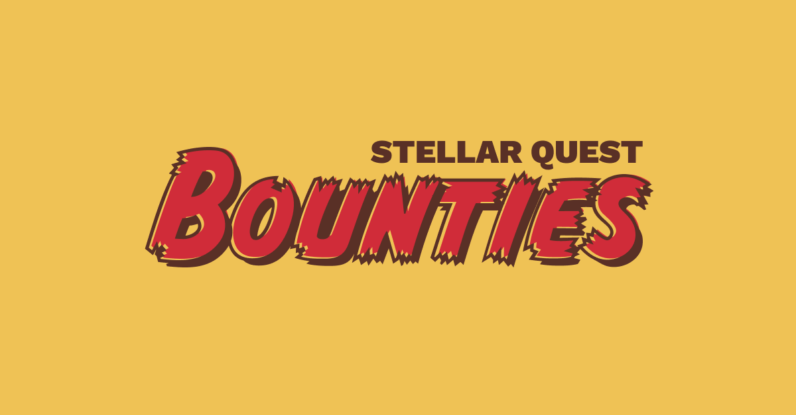

# Stellar Quest Bounties

Stellar Quest Bounties is an extension of the traditional, series based [Stellar Quest](https://quest.stellar.org/) challenges allowing seasoned and passionate Stellar Questers to continue their journey of education and earning during the "lean times" between Stellar Quest series.

Additional to this Stellar Quest Bounties provides an avenue for directing smaller amounts of XLM towards more granular, achievable, back-burner tasks as determined by SDF, Stellar partners and you! the Stellar Community.

## Stellar Quest Bounty Structure

Stellar Quest Bounties are broken up into two distinct groups, well really three but primarily two. Hunters and Reviewers. The names are pretty self explanatory with Hunters being those doing the work of achieving the spec of the bounty and Reviewers auditing that work to ensure it meets the standard and actually accomplishes the task sufficiently. The unique bit here is that both Hunters and Reviewers get paid in this system, not just those doing the bounty work.

The third group at work here are those writing and funding the bounties, but that most often will be SDF and/or other Stellar based business and enterprises. However you too can write bounties! (Hint there's even a continuous [bounty for writing bounties](https://github.com/tyvdh/stellar-quest-bounties/blob/main/bounties/level-1/create-bounties.md)!). This third group isn't heavily involved in the bounty process outside of an initial PR into the `./bounties` directory so we won't spend too much time on them.

For more info about writing a bounty see our [Bounty Template](https://github.com/tyvdh/stellar-quest-bounties/blob/main/bounties/README.md) our ["Submit a Bounty"](https://github.com/tyvdh/stellar-quest-bounties/blob/main/bounties/level-1/create-bounties.md) bounty and the [Bounty Ideas](https://github.com/tyvdh/stellar-quest-bounties/discussions/categories/bounty-ideas) Discussions category.

### Hunters
Can claim and accomplish bounties in exchange for rewards.

Hunters claim open bounties at the level they are qualified for and complete the objectives, finally submitting the task for review by a reviewer. The reviewer will assign the task a state of either pass, fail or retry. Upon pass the hunter is awarded their share of the award amount as detailed by the bounty spec.

### Reviewers
Can review bounties in exchange for rewards.

Reviewers claim reviewable tasks and complete a review on the task assigning it a state of pass, fail or retry. Upon review completion the reviewer is awarded their share of the award amount as detailed by the bounty spec.

## Bounty Types
There are three types of bounties in the Stellar Quest Bounties universe. Each with their own merits, joys and sorrows. Choose wisely.

### Continuous
The first and most common bounty type is the educational bounty. These aim at being longer format and less strict Stellar Quest challenges. These are evergreen bounties able to be claimed forever and always by any curious newcomer able and eager to test their knowledge and increase in experience. Don't let the lower value award fool you, these are great bounties to level up your skills such that bigger bounties and future Stellar Quests are more easily conquered.

### Capped ({x})
The second bounty type is the capped bounty. These tend to be relatively short lived and achievable bounties. There exists a limited number of awards for each bounty as denoted by the cap. These are most often employed when a PR, service or contribution is needed quickly and the cost is related more towards an answer arriving speedily and less that it be something specific. It's also a great bounty type for exploring innovative answers and testing assumptions by allowing for several different answers and explorations.

### Competitive
The last bounty type is the competitive bounty which is rewarded in a graduated manner according to the details laid out in the bounty file. These will be short lived, well structured and event based bounties with awards being paid out top to bottom for anyone meeting review criteria. These aren't incredible common as we have the [SCF](https://communityfund.stellar.org/) for more structured, long format competitive funding but occasionally you just need a little something different and for that we have competitive bounties.

## Flow for Bounty Hunters

Ready to start claiming bounties and earning rewards? Here's how.

- **Step 1: Pick a bounty**
  - Look through [all of the available bounties](https://github.com/tyvdh/stellar-quest-bounties/tree/main/bounties) in the `/bounties` directory in this repo. They are divided into 3 difficulty levels so chose one which feels appropriate to your skill, level of involvement and the earning potential that excites you.
  - Be sure and read all the bounty instructions and details carefully though, as not all bounties are created and structured equally. Some are always available to claim, others are capped or may only accept 1 entry as viable for payout, so pick accordingly.
  - You can [look through the issues](https://github.com/tyvdh/stellar-quest-bounties/issues) tab to discover which bounties are being worked on by whom. Who knows, maybe you could team up with someone and solve a bounty together!

- **Step 2: Open a new issue**
  - Once you've chosen a bounty your next task is to "claim" it by opening a new issue via the [Begin The Hunt](https://github.com/tyvdh/stellar-quest-bounties/issues/new?assignees=&labels=&template=begin-the-hunt.yml) issue template.
  - Bounty issues can exist in 3 states, all demarcated by a color coded emoji, [🔵&nbsp;, 🟢&nbsp;, 🟣&nbsp;].
    ### Mark your progress
    - [x] 🔵&nbsp; Started working
    - [ ] 🟢&nbsp; Ready for review
    - [ ] 🟣&nbsp; Review completed

     
    
    - 🔵&nbsp; You have claimed and begun work on the bounty. You are actively making progress and should comment in the issue with any progress or details for reviewers.
    - 🟢&nbsp; You have finished the bounty and are ready to begin the review process. Reviewers will now begin to review your work and assess it's level of completeness. From here more work may be requested to finish the bounty or your work may be rejected if you're really off target.
    - 🟣&nbsp; The review is complete and it's time to await payment for a job well done!
    
    You are strongly encouraged to search for other similar issues before beginning work to ensure you're not about to compete for a bounty which already has a max number of claimants. If that's the case though feel free to explore any open issues and offer assistance where it's needed. Team bounties often do better than solos.

- **Step 3: Work on your bounty**
  - The next step is obvious, do the work! Please ensure you stick closely to the bounty scope, guidelines and details as laid out in the spec doc. Do your work excellently and you stand a great chance of claiming the reward.
  - Be sure and post progress occasionally on your bounty issue in order to catch any potential issues as early as possible and to confirm you're still working and progressing on the bounty.

- **Step 4: Have your bounty reviewed**
  - Once you've completed the bounty sufficiently and believe it to be completed you should change the status on the issue from a 🔵&nbsp; to a 🟢&nbsp; to denote your bounty is ready for review.
  - Feel free to continue to work on your bounty but try and be responsive once reviewers begin commenting on your bounty. Prioritize their comments as their goal is to see that the bounty terms are met.

- **Step 5: Claim your reward**
  - Once the review has concluded your bounty will either be resolved as ineligible (unlikely but possible in the case of a weak attempt or ineligible duplicate bounty claims) or ready for payout.
  - If the latter you should adjust the bounty to the 🟣&nbsp; status so we can ensure a timely reward payout.
  - In order to process payouts for our bounty hunters, it's necessary for the <abbr title="Stellar Development Foundation">SDF</abbr> to collect certain information from you. Make sure you've [added your public address here](https://github.com/tyvdh/stellar-quest-bounties/blob/main/ADDRESSES.yml). You'll also need to submit KYC and tax information on the [Stellar Quest website](https://quest.stellar.org). These steps can be taken at any time, even before you've begun the bounty.
  - Payments will be made in the form of claimable balances and a comment with the transaction hash containing that claimable balance will be posted to your issue. From there it's a simple task of claiming your XLM bounty reward!

## Flow for Bounty Reviewers

Ready to review bounties and get paid for your expertise? Here's how.

- **Step 1: Choose a bounty**
  - Look through [all of the available bounties](https://github.com/tyvdh/stellar-quest-bounties/issues) in the `Issues` tab in this repo. They are divided into 3 difficulty levels so chose ones which feel appropriate to your skill, level of involvement and the earning potential that excites you.
  - Be sure and read all bounty instructions and details carefully as it's your job to ensure bounties sufficiently meet the criteria for the reward payout. You can only do that best when you are familiar with the bounty goals and objectives yourself.
  
- **Step 2: Review the bounty**
  - Clone the repo, pull the PR, test the solution, click the buttons, interact with the interface. It's your job to test and ensure the provided solution for the bounty actually meets the requirements. Leave comments, ask questions, be kind.
  - You have two courses of action on every bounty you review. Most commonly you will review, comment, resolve and discuss until the bounty is complete and you give it your stamp of approval for payout. In rare cases however a bounty may not have put in sufficient effort and you should mark it for tossing. In that case neither the hunter nor the reviewer will be rewarded so be slow to mark a bounty for the trash.

- **Step 3: Claim your reward**
  - Once you've marked a bounty as complete your job is done until the payout is made to both the hunter and you.
  - In order to process payouts for our bounty reviewers, it's necessary for the <abbr title="Stellar Development Foundation">SDF</abbr> to collect certain information from you. Make sure you've [added your public address here](https://github.com/tyvdh/stellar-quest-bounties/blob/main/ADDRESSES.yml). You'll also need to submit KYC and tax information on the [Stellar Quest website](https://quest.stellar.org). These steps can be taken at any time, even before you've begun reviewing any bounties.
  - Payments will be made in the form of claimable balances and a comment with the transaction hash containing that claimable balance will be posted to the bounty issue which you reviewed. From there it's a simple task of claiming your XLM bounty reward!
